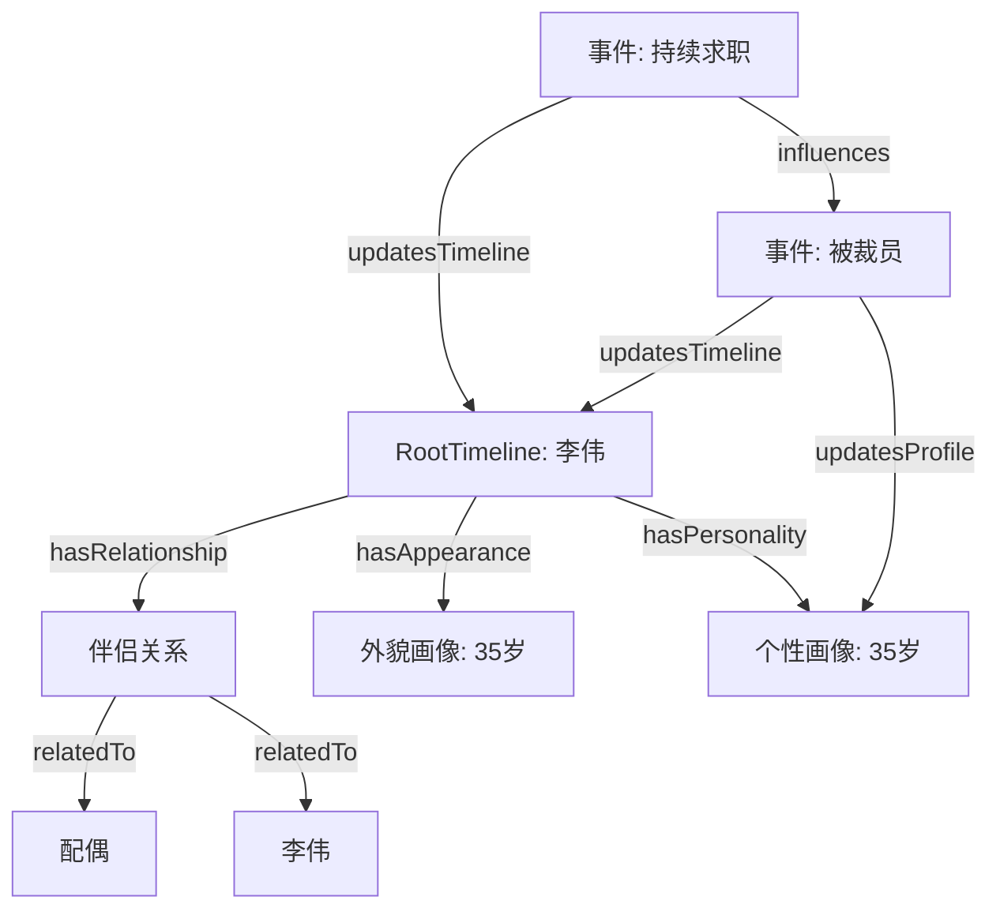

# Life Data Structure (根时间线 + 事件更新)

本方案将**人生阶段与外部事件统一为“事件”**，不再区分本质差异；一切变化都由事件触发。核心是一个**根时间线节点（RootTimeline）**，它代表“这个人”，并承载三大要素：**人际关系、外貌、个性**。事件只负责**更新**这些要素，根时间线的更新轨迹即构成这个人的一生。

---

## 1) 核心模型（图结构）

### 节点类型

- **RootTimeline**：根时间线（代表“这个人”）
- **Event**：事件（统一承载人生阶段、个人经历、外部冲击）
- **Person**：人物（本人、家人、朋友、同事等）
- **Relationship**：关系（亲子、伴侣、同事、师生、朋友等）
- **Entity**：参与主体（组织、地点等，可选）
- **AppearanceProfile**：外貌特征（阶段性或事件性）
- **PersonalityProfile**：个性/气质画像（阶段性或事件性）

### 关系类型

- **updatesTimeline**：事件更新根时间线（Event → RootTimeline）
- **updatesProfile**：事件更新某个画像（Event → Appearance/Personality/Relationship）
- **partOf** / **hasPart**：事件聚合（大事件包含多个子事件）
- **leadsTo**：因果或推动
- **influences**：影响/扰动（强度可量化）
- **blocks**：阻断/延迟
- **involves**：参与（人/组织/地点）
- **relatedTo**：人际关系连接（Person ↔ Relationship ↔ Person）
- **familyOfOrigin**：原生家庭归属（Person → Family）
- **memberOf**：加入某个家庭/关系圈子（Person → Family/Group）
- **hasRelationship**：根时间线包含的人际关系（RootTimeline → Relationship）
- **hasAppearance**：根时间线包含的外貌画像（RootTimeline → AppearanceProfile）
- **hasPersonality**：根时间线包含的个性画像（RootTimeline → PersonalityProfile）

> 说明：原生家庭建议建模为一个 `Family`（可使用 `Entity` 或扩展类型），成员用 `memberOf` 关联；人物之间的具体关系用 `Relationship` 节点表示（可承载开始/结束时间、亲密度、爱恨程度等属性）。

---

## 2) JSON-LD 数据结构（推荐）

使用 JSON-LD 便于 AI 理解，同时保持结构化与可扩展性。

```json
{
  "@context": {
    "name": "https://schema.org/name",
    "startDate": "https://schema.org/startDate",
    "endDate": "https://schema.org/endDate",
    "RootTimeline": "https://example.org/RootTimeline",
    "Event": "https://example.org/Event",
    "Person": "https://example.org/Person",
    "Relationship": "https://example.org/Relationship",
    "Entity": "https://example.org/Entity",
    "AppearanceProfile": "https://example.org/AppearanceProfile",
    "PersonalityProfile": "https://example.org/PersonalityProfile",
    "updatesTimeline": { "@id": "https://example.org/updatesTimeline", "@type": "@id" },
    "updatesProfile": { "@id": "https://example.org/updatesProfile", "@type": "@id" },
    "partOf": { "@id": "https://schema.org/isPartOf", "@type": "@id" },
    "hasPart": { "@id": "https://schema.org/hasPart", "@type": "@id" },
    "leadsTo": { "@id": "https://example.org/leadsTo", "@type": "@id" },
    "influences": { "@id": "https://example.org/influences", "@type": "@id" },
    "blocks": { "@id": "https://example.org/blocks", "@type": "@id" },
    "involves": { "@id": "https://example.org/involves", "@type": "@id" },
    "relatedTo": { "@id": "https://example.org/relatedTo", "@type": "@id" },
    "familyOfOrigin": { "@id": "https://example.org/familyOfOrigin", "@type": "@id" },
    "memberOf": { "@id": "https://example.org/memberOf", "@type": "@id" },
    "hasRelationship": { "@id": "https://example.org/hasRelationship", "@type": "@id" },
    "hasAppearance": { "@id": "https://example.org/hasAppearance", "@type": "@id" },
    "hasPersonality": { "@id": "https://example.org/hasPersonality", "@type": "@id" }
  },
  "@graph": [
    {
      "@id": "timeline:self",
      "@type": "RootTimeline",
      "name": "我的人生时间线",
      "hasRelationship": ["relationship:parent-child"],
      "hasAppearance": ["appearance:university"],
      "hasPersonality": ["personality:university"]
    },
    {
      "@id": "person:self",
      "@type": "Person",
      "name": "我",
      "familyOfOrigin": "family:origin"
    },
    {
      "@id": "person:mother",
      "@type": "Person",
      "name": "母亲",
      "memberOf": "family:origin"
    },
    {
      "@id": "family:origin",
      "@type": "Entity",
      "name": "原生家庭"
    },
    {
      "@id": "relationship:parent-child",
      "@type": "Relationship",
      "name": "亲子关系",
      "startDate": "1990-01-01",
      "loveHate": 0.5,
      "relatedTo": ["person:self", "person:mother"]
    },
    {
      "@id": "appearance:university",
      "@type": "AppearanceProfile",
      "name": "大学阶段外貌特征",
      "description": "短发、近视，常穿深色外套。",
      "startDate": "2012-09-01",
      "endDate": "2016-06-30",
      "tags": ["发型:短发", "配饰:眼镜", "风格:简洁"]
    },
    {
      "@id": "personality:university",
      "@type": "PersonalityProfile",
      "name": "大学阶段个性特征",
      "description": "理性谨慎，社交倾向中等。",
      "startDate": "2012-09-01",
      "endDate": "2016-06-30",
      "hormoneLevels": {
        "testosterone": "中",
        "serotonin": "中偏低"
      },
      "traits": ["谨慎", "自律"],
      "tags": ["气质:内向-中性", "情绪:稳定"]
    },
    {
      "@id": "event:university-stage",
      "@type": "Event",
      "name": "大学阶段",
      "startDate": "2012-09-01",
      "endDate": "2016-06-30",
      "updatesTimeline": "timeline:self",
      "updatesProfile": ["appearance:university", "personality:university"],
      "involves": ["person:self"]
    },
    {
      "@id": "event:pandemic",
      "@type": "Event",
      "name": "疫情",
      "startDate": "2020-01-01",
      "influences": "event:job-change"
    },
    {
      "@id": "event:job-change",
      "@type": "Event",
      "name": "转行",
      "startDate": "2021-05-01",
      "updatesTimeline": "timeline:self",
      "involves": ["person:self"]
    }
  ]
}
```

---

## 3) 展示层建议（时间线）

**根时间线主轴**：按事件顺序展示根时间线的更新记录。

- 1989 出生
- 1996–2002 小学阶段
- 2002–2008 中学阶段
- 2008–2012 大学阶段
- 2012 进入软件行业
- 2024 被裁员
- 2024 持续求职

展示层可由图结构自动生成：只需要拉取所有 `updatesTimeline` 指向根时间线的事件，并按时间排序。

---

## 4) 示例：35 岁失业的中国中年程序员（常识建模）

以下示例仅用于演示结构，不涉及真实个人信息。

### 4.1 JSON-LD 数据示例（节选：从出生开始）

```json
{
  "@context": {
    "name": "https://schema.org/name",
    "startDate": "https://schema.org/startDate",
    "endDate": "https://schema.org/endDate",
    "RootTimeline": "https://example.org/RootTimeline",
    "Event": "https://example.org/Event",
    "Person": "https://example.org/Person",
    "Relationship": "https://example.org/Relationship",
    "Entity": "https://example.org/Entity",
    "AppearanceProfile": "https://example.org/AppearanceProfile",
    "PersonalityProfile": "https://example.org/PersonalityProfile",
    "updatesTimeline": { "@id": "https://example.org/updatesTimeline", "@type": "@id" },
    "updatesProfile": { "@id": "https://example.org/updatesProfile", "@type": "@id" },
    "influences": { "@id": "https://example.org/influences", "@type": "@id" },
    "involves": { "@id": "https://example.org/involves", "@type": "@id" },
    "hasRelationship": { "@id": "https://example.org/hasRelationship", "@type": "@id" },
    "hasAppearance": { "@id": "https://example.org/hasAppearance", "@type": "@id" },
    "hasPersonality": { "@id": "https://example.org/hasPersonality", "@type": "@id" }
  },
  "@graph": [
    {
      "@id": "timeline:li-wei",
      "@type": "RootTimeline",
      "name": "李伟的人生时间线",
      "hasRelationship": ["relationship:spouse"],
      "hasAppearance": ["appearance:mid-30s"],
      "hasPersonality": ["personality:mid-30s"]
    },
    {
      "@id": "person:li-wei",
      "@type": "Person",
      "name": "李伟"
    },
    {
      "@id": "relationship:spouse",
      "@type": "Relationship",
      "name": "伴侣关系",
      "startDate": "2016-10-01",
      "loveHate": 0.6,
      "relatedTo": ["person:li-wei", "person:spouse"]
    },
    {
      "@id": "person:spouse",
      "@type": "Person",
      "name": "配偶"
    },
    {
      "@id": "appearance:mid-30s",
      "@type": "AppearanceProfile",
      "name": "三十五岁外貌特征",
      "description": "轻微发际线后移，常穿休闲衬衫与牛仔裤。",
      "tags": ["发型:短发", "风格:休闲"]
    },
    {
      "@id": "personality:mid-30s",
      "@type": "PersonalityProfile",
      "name": "三十五岁个性特征",
      "mbti": "ISTJ",
      "traits": ["务实", "谨慎"],
      "hormoneLevels": { "testosterone": "中", "serotonin": "中偏低" },
      "moodBaseline": "易焦虑"
    },
    {
      "@id": "event:layoff",
      "@type": "Event",
      "name": "被裁员",
      "startDate": "2024-06-01",
      "updatesTimeline": "timeline:li-wei",
      "updatesProfile": ["personality:mid-30s"],
      "involves": ["person:li-wei"]
    },
    {
      "@id": "event:job-search",
      "@type": "Event",
      "name": "持续求职",
      "startDate": "2024-06-15",
      "influences": "event:layoff",
      "updatesTimeline": "timeline:li-wei",
      "involves": ["person:li-wei"]
    },
    {
      "@id": "event:birth",
      "@type": "Event",
      "name": "出生",
      "startDate": "1989-05-12",
      "updatesTimeline": "timeline:li-wei",
      "involves": ["person:li-wei"]
    },
    {
      "@id": "event:primary-school",
      "@type": "Event",
      "name": "小学阶段",
      "startDate": "1996-09-01",
      "endDate": "2002-06-30",
      "updatesTimeline": "timeline:li-wei",
      "involves": ["person:li-wei"]
    },
    {
      "@id": "event:middle-school",
      "@type": "Event",
      "name": "中学阶段",
      "startDate": "2002-09-01",
      "endDate": "2008-06-30",
      "updatesTimeline": "timeline:li-wei",
      "involves": ["person:li-wei"]
    },
    {
      "@id": "event:university",
      "@type": "Event",
      "name": "大学阶段",
      "startDate": "2008-09-01",
      "endDate": "2012-06-30",
      "updatesTimeline": "timeline:li-wei",
      "involves": ["person:li-wei"]
    },
    {
      "@id": "event:first-job",
      "@type": "Event",
      "name": "进入软件行业",
      "startDate": "2012-07-01",
      "updatesTimeline": "timeline:li-wei",
      "involves": ["person:li-wei"]
    }
  ]
}
```

### 4.2 可视化（Mermaid 图）



### 4.3 示例：20 岁留学鬼混的富二代（常识建模）

以下示例仅用于演示结构，不涉及真实个人信息。

```json
{
  "@graph": [
    {
      "@id": "timeline:chen-hao",
      "@type": "RootTimeline",
      "name": "陈浩的人生时间线",
      "hasRelationship": ["relationship:friends-circle"],
      "hasAppearance": ["appearance:age-20"],
      "hasPersonality": ["personality:age-20"]
    },
    {
      "@id": "person:chen-hao",
      "@type": "Person",
      "name": "陈浩"
    },
    {
      "@id": "relationship:friends-circle",
      "@type": "Relationship",
      "name": "社交圈关系",
      "startDate": "2022-09-01",
      "loveHate": 0.5,
      "relatedTo": ["person:chen-hao", "person:friends"]
    },
    {
      "@id": "person:friends",
      "@type": "Person",
      "name": "留学朋友圈"
    },
    {
      "@id": "appearance:age-20",
      "@type": "AppearanceProfile",
      "name": "二十岁外貌特征",
      "description": "发型时髦，常穿品牌服饰。",
      "tags": ["风格:潮流", "配饰:名表"]
    },
    {
      "@id": "personality:age-20",
      "@type": "PersonalityProfile",
      "name": "二十岁个性特征",
      "mbti": "ESFP",
      "traits": ["外向", "冲动"],
      "hormoneLevels": { "testosterone": "中偏高", "serotonin": "中" },
      "moodBaseline": "易兴奋"
    },
    {
      "@id": "event:study-abroad",
      "@type": "Event",
      "name": "赴海外留学",
      "startDate": "2022-09-01",
      "updatesTimeline": "timeline:chen-hao",
      "involves": ["person:chen-hao"]
    },
    {
      "@id": "event:party-life",
      "@type": "Event",
      "name": "频繁社交与玩乐",
      "startDate": "2023-01-01",
      "updatesTimeline": "timeline:chen-hao",
      "updatesProfile": ["personality:age-20"],
      "involves": ["person:chen-hao"]
    }
  ]
}
```

## 5) 约定字段（建议）

每个节点建议包含字段：

- `@id`：唯一标识
- `@type`：节点类型
- `name`：名称
- `startDate` / `endDate`：时间范围
- `description`：文本描述（可选）
- `importance`：重要程度（0-1，可选）
- `tags`：标签（可选）
- `confidence`：置信度（0-1，可选）
- `source`：来源（可选）

对于 **Relationship** 节点，可加入：

- `relationshipType`：关系类型（亲子/伴侣/同事等）
- `closeness`：亲密度（0-1）
- `loveHate`：爱恨程度（0-1，默认值 0.5）

对于 **AppearanceProfile** 节点，可加入：

- `description`：外貌描述（自然语言）
- `style`：风格标签（如简约/运动/商务）
- `markers`：显著特征（如发型、眼镜、体型变化）

对于 **PersonalityProfile** 节点，可加入：

- `mbti`：MBTI 类型（如 ISTJ/ENFP）
- `traits`：性格特质标签（如自律、谨慎）
- `hormoneLevels`：相关生理指标（如雄性激素、血清素水平，允许“低/中/高”等定性值）
- `moodBaseline`：情绪基线（如稳定/易波动）

---

## 6) 为什么这个结构更“符合常识”

- 事件在本质上都是“发生了某件事”，无需强行区分外部/阶段
- “这个人”被抽象为根时间线 + 三要素（人际、外貌、个性）
- 事件只负责更新，根时间线的更新轨迹即是一生

---

## 7) 下一步可做的扩展

- 为事件增加 `eventType`（如 life-stage / social / crisis）以便筛选展示
- 对画像节点增加版本化（记录每次更新的版本号）
- 将图数据导入图数据库（Neo4j 等）用于查询与可视化
